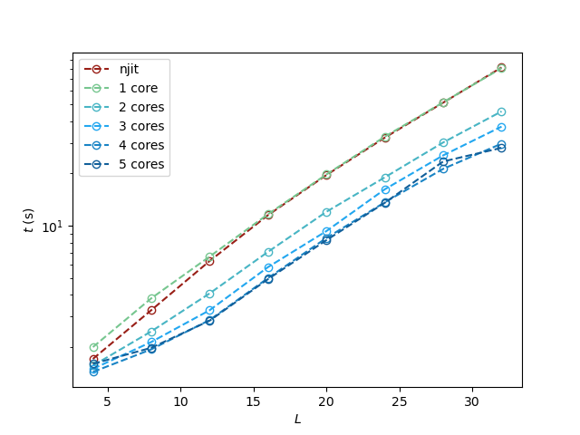

# Testing Documentation
In this file we detail the simulation implementation and the results of the optimization testing.

## Simulation parameters
The following simulation parameters were used in testing

| Parameter | Value/s |
| --- | --- | 
| lattice size | 2,4,6,8,10,12,16,20,24,28,32 | 
| start t | 2.00 |
| end t | 2.5 | 
| number of t | 30 |
| ss points | 2000 |

3 trials of the different parameter combinations were used and the results were averaged over the 3 trials.

## Calculation Time

### Speed boost
The figure below shows the average calculation time in seconds for each trial of the simulation runs.

For larger values of $L$, the Wolff Cluster algorithm takes a longer time to construct clusters especially for low $T$ values. So calculation time is greater for larger lattice sizes.

Overall, the best performance was found when combining both `multiprocessing` parallelism and Numba JIT compilation.

### Overhead effects

Due to the overhead of both optimization, shorter simulations will still be quicker on the base code as shown in the figure below:

### Parallelization effects
As expected, increasing the number of cores used in `multiprocessing` improves the speed of the calculations. This is true for both base parallel code (see Figure below):

and also for the njit parallelization code (see Figure below):

We also see the effects of the overheads of parallelization below

where the 1 core parallel is slower than the base code. This effect is more pronounced for njitparallel

Each core will run the JIT compilation. So increasing the number of cores also increases the overhead for the whole simulation.

## Accuracy
We estimate the critical temperature produced by the simulation by fitting the specific heat values for different $T$ to a lorenztian function.

$$\text{Fitting Function} = \frac{A}{(T-T_c)^2 + B}$$

The estimated critical temperatures are then compared to the theoretical values for the 2D Ising model ($T_c = 2.26918531421$)

Results show that `multiprocessing` parallelization results are identical to that of the base code, so long as the random number seed is consistent.
Meaning, the parallelization does not change the results. On the other hand, we have seen variations in the results generated by Numbas JIT compilation (See figure below).

This variation can be attributed to Numba [not supporting](https://numba.readthedocs.io/en/stable/developer/autogen_numpy_listing.html?highlight=np%2Brandom) `numpy`'s random number generation scheme (which was used in the simulation). Nevertheless, these variations do not change the accuracy of the resulting $T_c$ calculated.

And for large lattice sizes, the error remained below 1%.

